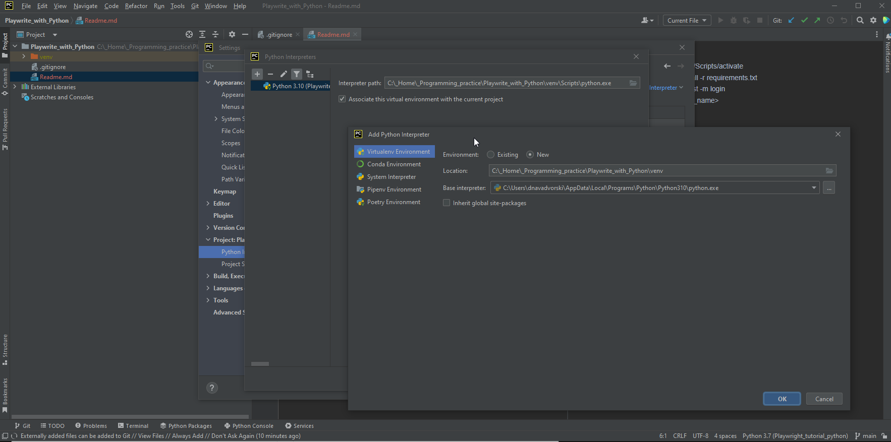

1. Clone Project
2. Create venv and activate: venv/Scripts/activate

3. Install requirements: pip install -r requirements.txt
4. Run tests, e.g. by marker: pytest -m login
5. or by test name: pytest -k <test_name>

