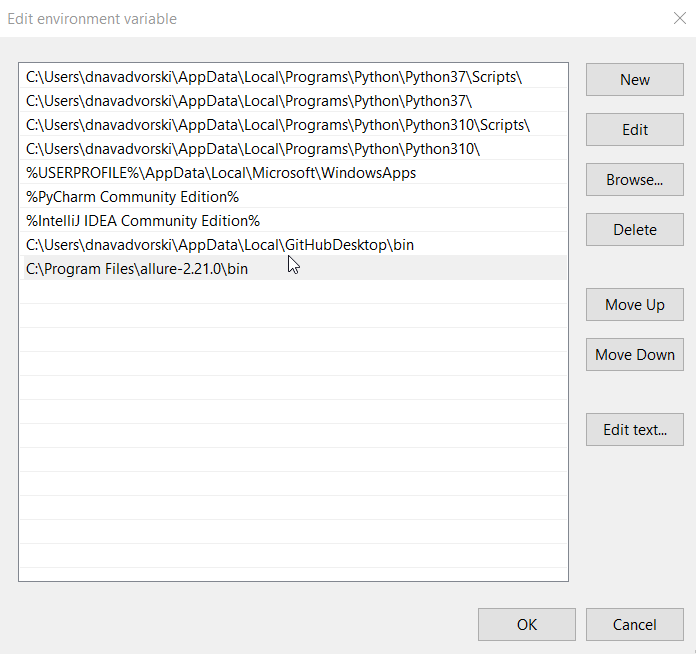

1. Clone Project
2. Create venv and activate: venv/Scripts/activate

3. Install requirements: pip install -r requirements.txt
4. Run tests, e.g. by marker: pytest -m login
5. or by test name: pytest -k <test_name>

Add Allure:
1. Add Allure to venv. Activate venv and run: **pip install allure-pytest**
2. Download allure.zip:
https://repo.maven.apache.org/maven2/io/qameta/allure/allure-commandline/
3. Unpack to C:\Program Files
4. Add Path to the system environment variables:
5. RELOAD PC
6. Check version: **allure --version**

User Allure:
https://docs.qameta.io/allure-report/#_pytest
To enable Allure listener to collect results during the test execution simply add --alluredir option and provide path to the folder where results should be stored. E.g.:

$ pytest --alluredir=/tmp/my_allure_results
To see the actual report after your tests have finished, you need to use Allure commandline utility to generate report from the results.

$ allure serve /tmp/my_allure_results
This command will show you generated report in your default browser.